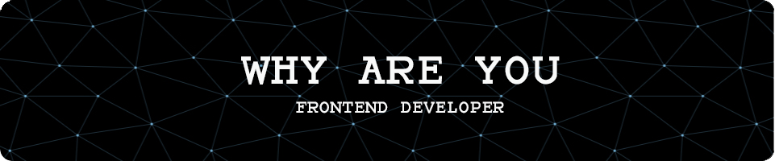

<h1 align="center">Hi there, I`m Chernov Nikita 💗</h1>

- 📚 I love FrontEnd developing.
- 💻 I love exploring new tech stack and building cool stuffs
- ✉️ You can shoot me an email at bionixxxd5@gmail.com! I'll try to respond as soon as I can;
- 📄 Please have a look at
  my [Resume(En)](https://drive.google.com/file/d/1WQ-SHH4kJgFPMzZmBR9Pnm4n1ovaillh/view?usp=sharing) | [Resume(Ru)](https://drive.google.com/file/d/1YIxE7WY8HkdrvC2De0L0dVrEMusFWp13/view?usp=share_link)
  for more details about me. I'm open to feedback and suggestions!

<h2 align="left" id="whyareyou-stack">🔥 Tech stack</h2>

> General

<table width='100%'>
  <tr>
    <td align="center" width="110" height="90">
      
       javascript
    </td>
    <td align="center" width="110" height="90">
      
       typescript
    </td>
        <td align="center" width="110" height="90">
      
       Html5
    </td>
         <td align="center" width="110" height="90"> 
      
       Css3
    </td>
    <td align="center" width="110" height="90">
      
       figma
    </td>
    <td align="center" width="110" height="90">
      
       git
    </td>
    <td align="center" width="110" height="90"> 
      
       yarn
    </td>
    <td align="center" width="110" height="90"> 
      
       npm
    </td>
     <td align="center" width="110" height="90"> 
      
       github
    </td>
    <td align="center" width="110" height="90"> 
      
       docker
    </td>
  </tr> 
</table>

> Testing

<table width='100%'>
  <tr>
     <td align="center" width="110" height="90"> 
      
       Jest
    </td>
    <td align="center" width="110" height="90"> 
      
       rt library
    </td>
        <td align="center" width="110" height="90"> 
      
       storybook
    </td>

  </tr> 
</table>

> Frontend

<table width='100%'>
  <tr>
   <td align="center" width="110" height="90">
      
       React JS
    </td>
     <td align="center" width="110" height="90">
      
       Next JS
    </td>
 <td align="center" width="110" height="90">
      
       Redux
    </td>
    <td align="center" width="110" height="90"> 
      
       Webpack
    </td>
    <td align="center" width="110" height="90">
      
       Sass
    </td>
   <td align="center" width="110" height="90">
      
       Tailwind
    </td>
</tr> 
</table>

## ⚙️ GitHub Analytics

## 📞 Get in touch

Are you interested in collaboration? I'm up to any inspiring projects. Get in touch with me through the attached links:

